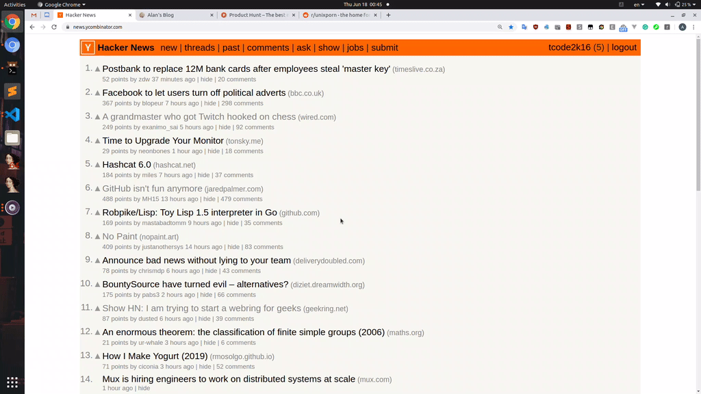
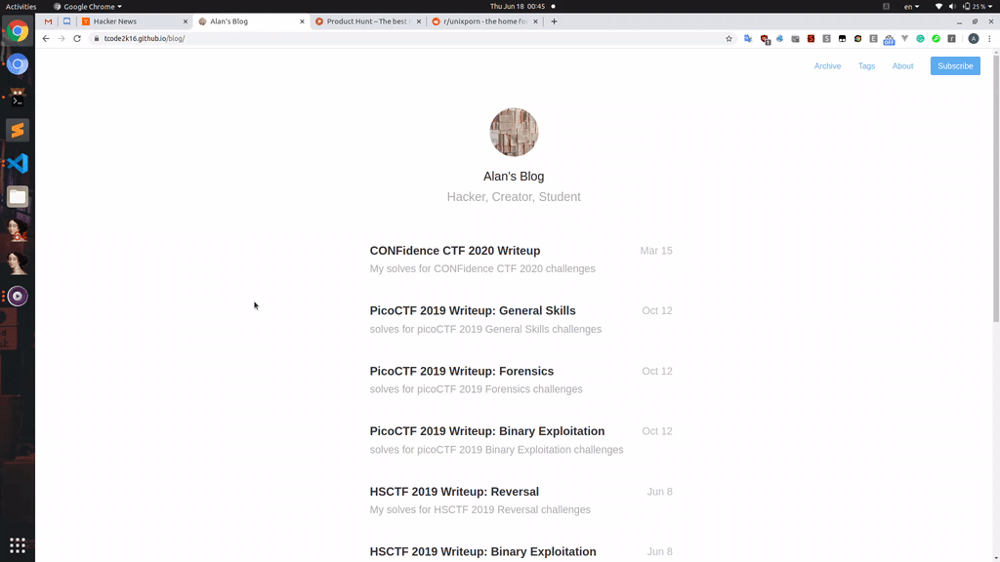

# rofi-chrome

rofi-chrome is a browser extension for better tab navigation without injecting javascript code on every tab you open.

## Features

### Switch between open tabs



### Open tab from history


### Search history from same domain


### Go to last tab




## Installation

First, make sure you have [python3](https://www.python.org), [rofi](https://github.com/davatorium/rofi), and one of the [supported browsers](#supported-browsers) installed.

Then, clone the git repo:

```sh
git clone https://github.com/JYisus/rofi-browser-tabs.git
```

Install native extension using the provided script:

```
cd rofi-chrome
./scripts/install.sh
```

Load the unpacked extension located at `rofi-chrome/extension` to the browser of your liking.

For example, if you are using chrome or chromium:

* Go to `chrome://extensions/` in the browser and check the box for Developer mode in the top right.
* Click the Load unpacked extension button and select the `rofi-chrome/extension` folder to install it.

And if you are using firefox:

* Go to `about:debugging#/runtime/this-firefox` in the browser
* Click the Load Temporary Add-on button and select the `rofi-chrome/extension` folder to install it.

Configure the shortcuts for the various commands (`chrome://extensions/shortcuts` for chrome and chromium /
`brave://extensions/shortcuts` for brave / `Manage Extension Shortcuts` in `about:addons` for firefox)

For your reference, I use:

- `alt+a` for `go to last tab`
- `alt+h` for `open tab from history`
- `alt+a` for `page-dependent search`
- `alt+s` for `switch to another tab`

Now, you have the extension working. Yay!

## Supported platforms

- Linux
- (more in the future)

## Supported browsers

- google chrome
- chromium
- firefox
- brave
- (more in the future)

## TODO

- [x] migrate from python2 to python3 -> (done by: (RKest)[https://github.com/RKest])
- [ ] support for other platforms
- [ ] support for other browsers
